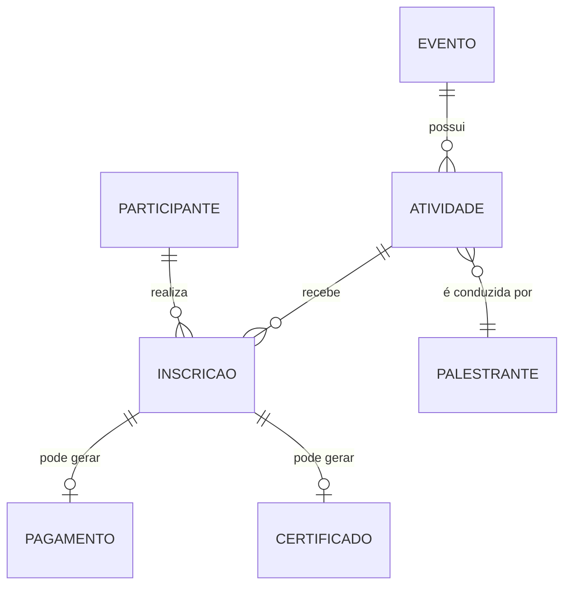

# Glossário de Domínio — Sistema Eventus

Criado para eliminar a ambiguidade identificada em `analise/lacunas-e-ambiguidades.md` (item A-01), em que os termos "evento", "workshop" e "atividade" eram usados de forma parcialmente intercambiável no material de elicitação.

## Termos

**Evento**
Ocorrência organizada pela Eventus (congresso, workshop isolado ou evento corporativo) que agrupa uma ou mais Atividades. Possui data(s), organizador responsável e pode ser gratuito ou pago.

**Atividade**
Unidade de programação dentro de um Evento (ex.: um workshop específico, uma palestra) com horário próprio, vagas próprias e, opcionalmente, um Palestrante responsável. Um Evento pode ter múltiplas Atividades ocorrendo em paralelo (trilhas simultâneas).

**Workshop**
Tipo específico de Atividade, com formato prático/participativo. Tratado no sistema como uma instância de Atividade.

**Inscrição**
Vínculo entre um Participante e um Evento ou Atividade, com um status associado (ver enum abaixo).

**Lista de Espera**
Fila de Participantes interessados em uma Atividade/Evento sem vagas disponíveis no momento da tentativa de inscrição.

**Certificado**
Documento emitido ao Participante após a realização do Evento, comprovando sua participação.

**Reembolso**
Devolução de valor pago por um Participante em caso de cancelamento de inscrição em Evento pago, quando aplicável.

## Perfis de Usuário (Atores)

| Perfil | Descrição resumida |
|--------|----------------------|
| Participante | Usuário que se inscreve em Eventos/Atividades. |
| Organizador | Cria e administra Eventos e Atividades, controla vagas e participantes. |
| Equipe Financeira | Confirma pagamentos e processa reembolsos. |
| Palestrante | Responsável por uma ou mais Atividades; consulta programação e participantes. |
| Equipe de TI | Desenvolve e mantém o sistema (não é usuário final da operação). |

## Enum — Status de Inscrição

- `pendente_pagamento` — inscrição criada, aguardando confirmação de pagamento (eventos pagos).
- `confirmada` — inscrição válida, vaga garantida.
- `em_lista_de_espera` — participante aguardando surgimento de vaga.
- `cancelada` — inscrição cancelada pelo participante ou pela organização.

> Este enum reflete apenas os estados citados ou inferidos diretamente do material de elicitação. O momento exato de transição entre `pendente_pagamento` e `confirmada` (reserva no início ou na confirmação do pagamento) é um ponto em aberto (ver L-06).

## Enum — Status de Pagamento

- `nao_aplicavel` — evento gratuito.
- `aguardando_confirmacao` — pagamento realizado, aguardando confirmação da equipe financeira.
- `confirmado` — pagamento confirmado.
- `reembolsado` — valor devolvido ao participante.

## Diagrama Entidade-Relacionamento (simplificado)

Este ER é intencionalmente simplificado (sem atributos detalhados) — um modelo de dados completo é prematuro enquanto lacunas como L-01 a L-08 não forem resolvidas com os stakeholders.
