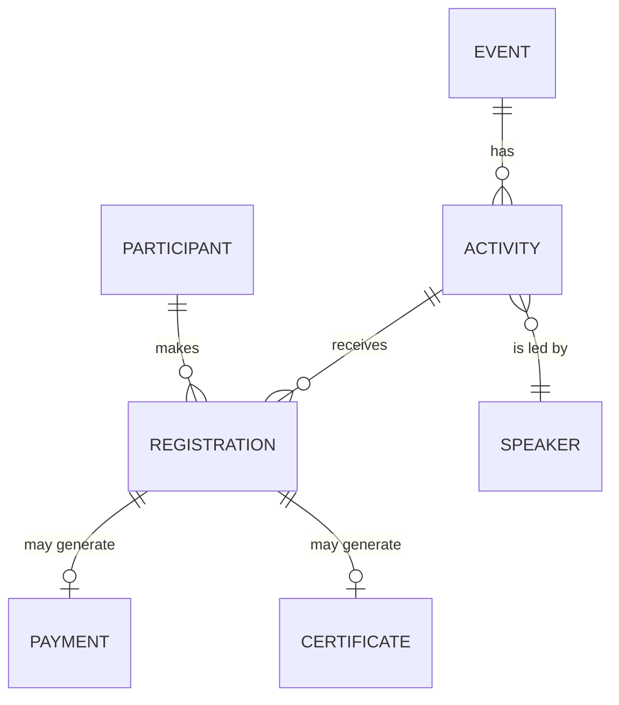

# Domain Glossary - Eventus System

Created to remove the ambiguity identified in `analysis/gaps-and-ambiguities.md` (item A-01), where the terms "event", "workshop" and "activity" were used partially interchangeably in the elicitation material.

## Terms

**Event**
An occurrence organized by Eventus (conference, standalone workshop or corporate event) that groups one or more Activities. It has date(s), a responsible organizer and can be free or paid.

**Activity**
A unit of programming within an Event (e.g. a specific workshop, a talk) with its own schedule, its own spots and, optionally, a responsible Speaker. An Event can have multiple Activities happening in parallel (simultaneous tracks).

**Workshop**
A specific type of Activity, with a hands-on/participatory format. Treated in the system as an instance of Activity.

**Registration**
The link between a Participant and an Event or Activity, with an associated status (see enum below).

**Waitlist**
A queue of Participants interested in an Activity/Event with no spots available at the time of the registration attempt.

**Certificate**
A document issued to the Participant after the Event takes place, proving their participation.

**Refund**
Return of the amount paid by a Participant when cancelling a registration in a paid Event, where applicable.

## User Profiles (Actors)

| Profile | Short description |
|---------|-------------------|
| Participant | User who registers for Events/Activities. |
| Organizer | Creates and manages Events and Activities, controls spots and participants. |
| Finance team | Confirms payments and processes refunds. |
| Speaker | Responsible for one or more Activities; views schedule and participants. |
| IT team | Develops and maintains the system (not an end user of the operation). |

## Enum - Registration Status

- `pending_payment` - registration created, awaiting payment confirmation (paid events).
- `confirmed` - valid registration, spot guaranteed.
- `waitlisted` - participant waiting for a spot to open up.
- `cancelled` - registration cancelled by the participant or by the organization.

> This enum reflects only the states cited or directly inferred from the elicitation material. The exact moment of transition between `pending_payment` and `confirmed` (reservation at the start or at payment confirmation) is an open point (see G-06).

## Enum - Payment Status

- `not_applicable` - free event.
- `awaiting_confirmation` - payment made, awaiting confirmation by the finance team.
- `confirmed` - payment confirmed.
- `refunded` - amount returned to the participant.

## Entity-Relationship Diagram (simplified)

This ER is intentionally simplified (no detailed attributes) - a complete data model is premature while gaps such as G-01 to G-08 are not resolved with the stakeholders.
